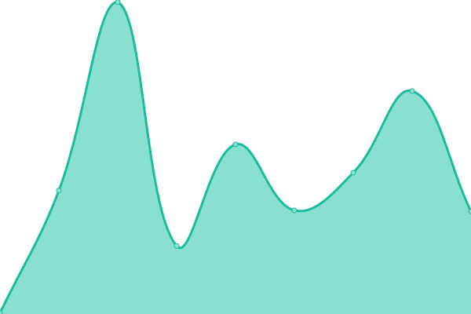
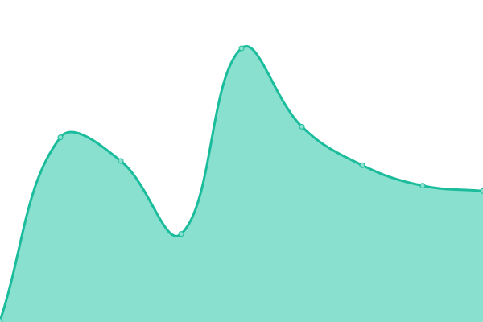
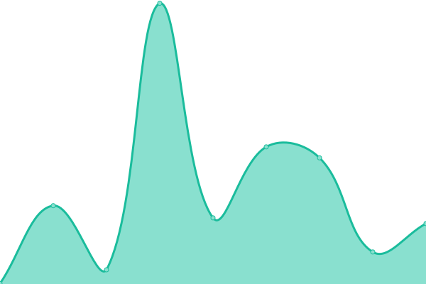
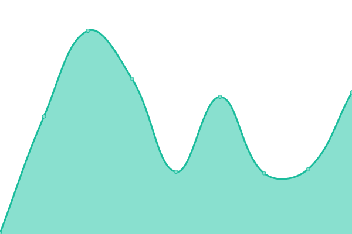

# [📈 Live Status](https://4hse.github.io/upptime): <!--live status--> **🟩 All systems operational**

This repository contains the open-source uptime monitor and status page for [4hse](www.4hse.com), powered by [Upptime](https://github.com/upptime/upptime).

With [Upptime](https://upptime.js.org), you can get your own unlimited and free uptime monitor and status page, powered entirely by a GitHub repository. We use [Issues](https://github.com/4hse/upptime/issues) as incident reports, [Actions](https://github.com/4hse/upptime/actions) as uptime monitors, and [Pages](https://4hse.github.io/upptime) for the status page.

<!--start: status pages-->
<!-- This summary is generated by Upptime (https://github.com/upptime/upptime) -->
<!-- Do not edit this manually, your changes will be overwritten -->
<!-- prettier-ignore -->
| URL | Status | History | Response Time | Uptime |
| --- | ------ | ------- | ------------- | ------ |
|  Service | 🟩 Up | [service.yml](https://github.com/4hse/upptime/commits/HEAD/history/service.yml) | 

 1124ms
     
 | 

<a href="https://status.4hse.com/history/service">100.00%</a>
    

|  Auth | 🟩 Up | [auth.yml](https://github.com/4hse/upptime/commits/HEAD/history/auth.yml) | 

 1662ms
     
 | 

<a href="https://status.4hse.com/history/auth">100.00%</a>
    

|  [AI](https://ai.4hse.com) | 🟩 Up | [ai.yml](https://github.com/4hse/upptime/commits/HEAD/history/ai.yml) | 

 463ms
     
 | 

<a href="https://status.4hse.com/history/ai">100.00%</a>
    

|  [MCP](https://mcp.4hse.com) | 🟩 Up | [mcp.yml](https://github.com/4hse/upptime/commits/HEAD/history/mcp.yml) | 

 534ms
     
 | 

<a href="https://status.4hse.com/history/mcp">100.00%</a>
    

|  [Mobile](https://mobile.4hse.com) | 🟩 Up | [mobile.yml](https://github.com/4hse/upptime/commits/HEAD/history/mobile.yml) | 

 175ms
     
 | 

<a href="https://status.4hse.com/history/mobile">100.00%</a>
    

|  [Docs](https://docs.4hse.com) | 🟩 Up | [docs.yml](https://github.com/4hse/upptime/commits/HEAD/history/docs.yml) | 

 150ms
     
 | 

<a href="https://status.4hse.com/history/docs">100.00%</a>
    

|  [Dev](https://dev.4hse.com) | 🟩 Up | [dev.yml](https://github.com/4hse/upptime/commits/HEAD/history/dev.yml) | 

 171ms
     
 | 

<a href="https://status.4hse.com/history/dev">100.00%</a>
    

|  [WWW](https://www.4hse.com) | 🟩 Up | [www.yml](https://github.com/4hse/upptime/commits/HEAD/history/www.yml) | 

 124ms
     
 | 

<a href="https://status.4hse.com/history/www">100.00%</a>
    

<!--end: status pages-->

[**Visit our status website →**](https://4hse.github.io/upptime)

## 📄 License

- Powered by: [Upptime](https://github.com/upptime/upptime)
- Code: [MIT](./LICENSE) © [Anand Chowdhary](https://anandchowdhary.com), supported by [Pabio](https://pabio.com)
- Data in the `./history` directory: [Open Database License](https://opendatacommons.org/licenses/odbl/1-0/)
